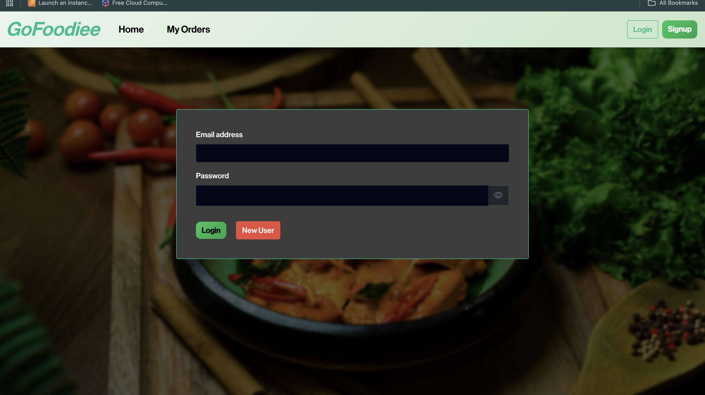
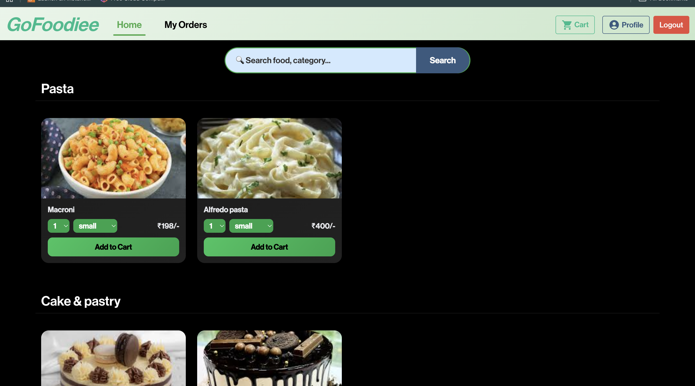
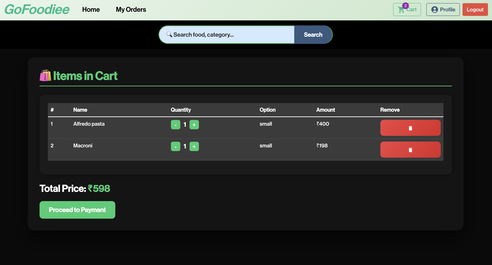
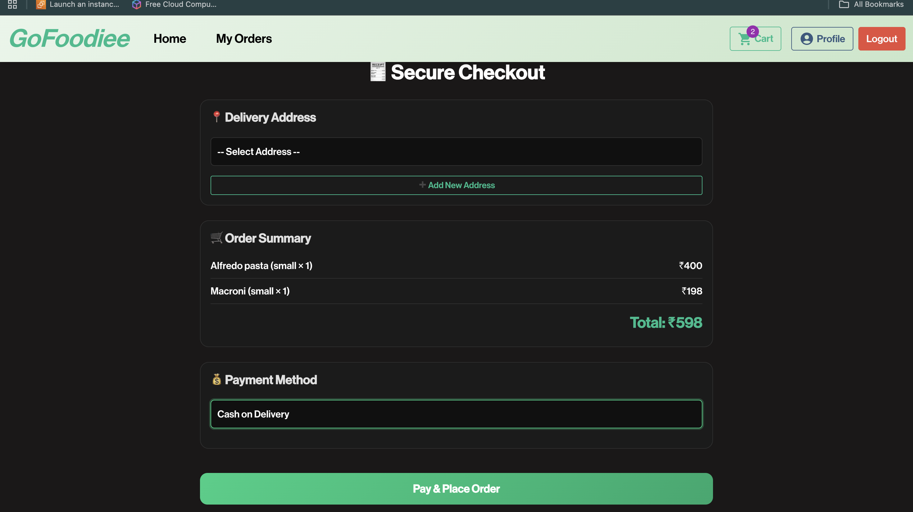
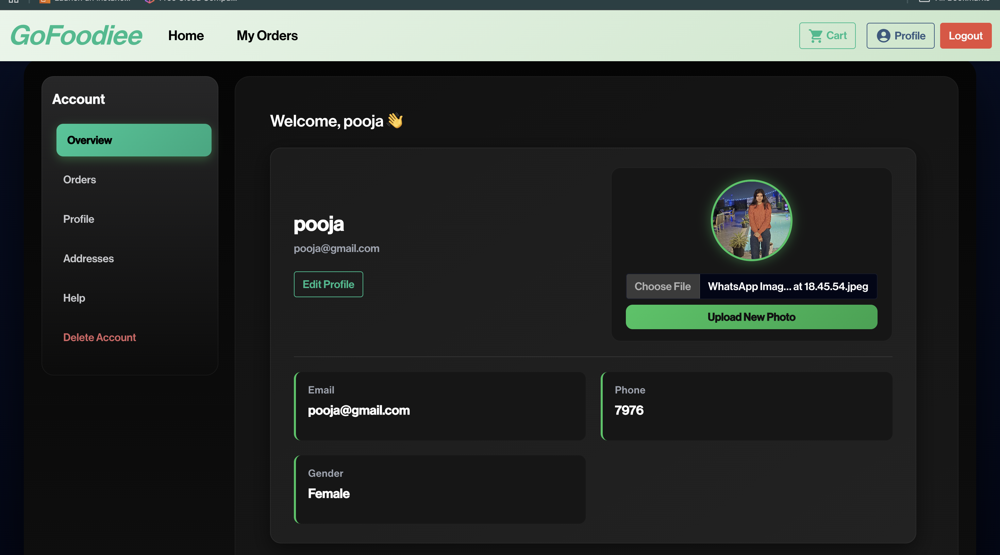
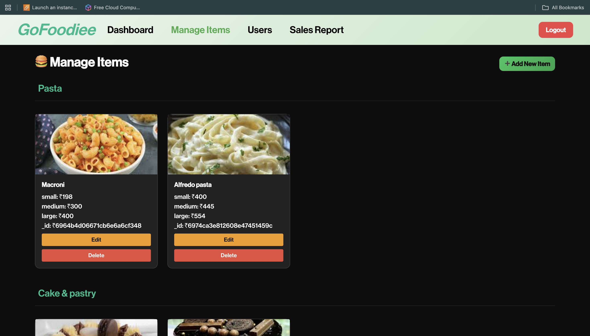

# 🍔 GoFoodie – Full Stack Food Ordering System

GoFoodie is a full-stack food ordering web application that allows users to browse food items, add them to cart, place orders, and manage their accounts.  
It also includes a powerful Admin Dashboard to manage users, food items, and sales reports.

The system is designed to be secure, scalable, and user-friendly, following modern full-stack development practices.

---

## 📌 Purpose of the Project

The purpose of this project is to build a real-world food ordering platform that demonstrates:

- Full-stack development skills  
- REST API design  
- Authentication & authorization  
- Database design  
- Admin management system  
- Real-time cart & order handling  

This project can be used as:
- Final year / major project  
- Full-stack portfolio project  
- Startup-style food app prototype  

---

## 🛠️ Tech Stack

### 🌐 Frontend
- React.js  
- JavaScript 
- Bootstrap & Custom CSS  

### ⚙️ Backend
- Node.js  
- Express.js

### 🗄️ Database
- MongoDB 

---

## ✨ Features

### 👤 User Features
- User registration & login  
- Browse food by categories  
- Search food items  
- Multiple size pricing (small / medium / large / half / full)  
- Add to cart & update cart  
- Place orders  
- Download invoice (PDF)  
- View order history  
- Manage addresses  
- Delete account  

---

### 🛡️ Admin Features
- Admin login system  
- Manage food items (Add / Update / Delete)  
- Category-based food system  
- Manage users  
- Remove users  
- View all orders  
- Sales report  
- Admin dashboard  
---

## 🏗️ System Architecture

- **Frontend (React)**  
  Handles UI, routing, cart system, admin dashboard, and API communication.

- **Backend (Node + Express)**  
  Handles authentication, business logic, food APIs, order APIs, and admin APIs.

- **Database (MongoDB)**  
  Stores users, food items, orders, addresses, and login history.

---

## ⚙️ How It Works

1. User registers or logs in  
2. JWT token is generated and stored  
3. Food items are fetched from MongoDB  
4. User selects size → price updates dynamically  
5. Cart managed using Context API  
6. Orders stored in MongoDB  
7. Invoice generated using PDFKit  
8. Admin manages system through protected APIs  

---

## ▶️ Run Locally

### 🔹 Backend Setup
```bash
cd backend
npm install
npm start

### 🔹 Frontend Setup
cd public
npm install
npm start
```
---

<hr style="border: 1px solid white; margin-top: 20px;">

<h1 style="color:#1E90FF;">UI Screenshots</h1>

<h3 style="color:#1E90FF;">Login Page</h3>


<h3 style="color:#1E90FF;">Home Page</h3>


<h3 style="color:#1E90FF;">Chat Interface</h3>


<h3 style="color:#1E90FF;">Memory System</h3>


<h3 style="color:#1E90FF;">Admin System</h3>



<h3 style="color:#1E90FF;">Admin System</h3>


